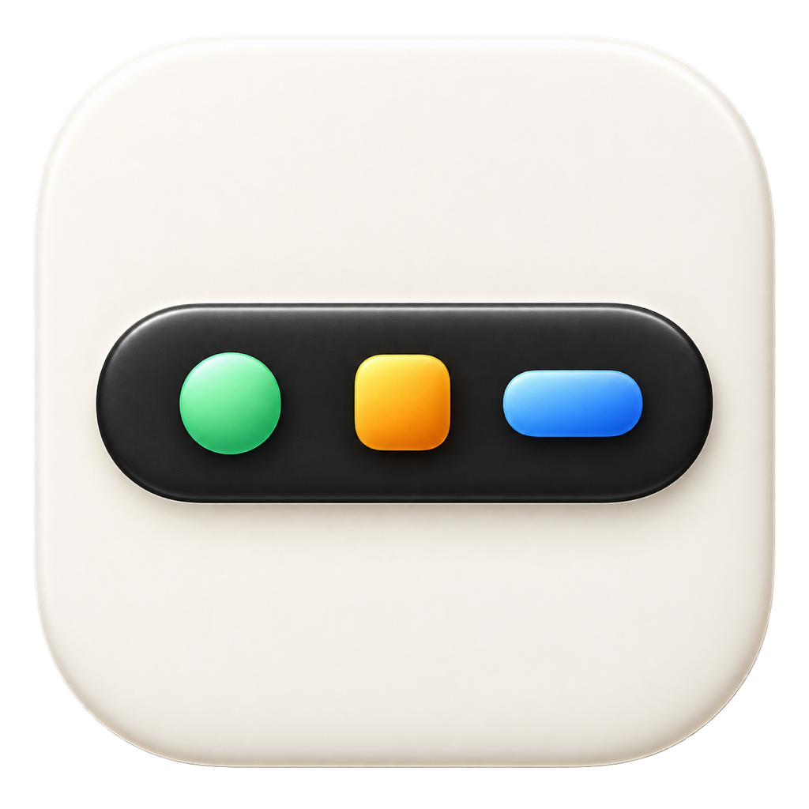

<p align="center">
  
</p>

# RehireBar

**Touch Bar 又被叫回来上班了。**

RehireBar 把本地与远程 AI 任务、模型、上下文和额度，放到 MacBook Pro 的 Touch Bar 上。内置支持 Codex。

[English](README.md) · [文档](docs/README.md)


<sub>实体 Touch Bar 截图，使用示例任务与数值。左侧显示额度剩余和重置时间；任务卡显示状态、模型／推理档位、上下文已用比例，运行中任务还显示耗时。</sub>

- 显示运行、等待、失败、同步和未知等任务状态。
- 点任务直接打开；放不下就横向滑动。
- 不可用的数据保持隐藏，过期的活跃状态自动失效。
- 手动收起后，普通刷新不会重新展开。

## 安装

需要 **macOS 15+** 和 **实体 Touch Bar**。Codex 集成需要 Codex CLI，任务跳转需要 Codex Desktop。

从[最新发布](https://github.com/mumchristmas/RehireBar/releases/latest)下载 **[Apple Silicon 版](https://github.com/mumchristmas/RehireBar/releases/download/v0.5.2/RehireBar-0.5.2-macos-arm64.zip)**或 **[Intel 版](https://github.com/mumchristmas/RehireBar/releases/download/v0.5.2/RehireBar-0.5.2-macos-x86_64.zip)**，核对校验值，将解压出的应用移入“应用程序”。

安装包使用 ad-hoc 签名，尚未公证。首次启动见[安装指南](docs/INSTALLATION.md)。仅从源码构建时需要带 Swift 6 的 Xcode：

```bash
bash scripts/build-app.sh
open 'dist/RehireBar.app'
```

## 扩展开发

接入其他 Agent 时，通常只需编写状态发布器，原子写入 `~/Library/Application Support/RehireBar/agents/<provider>.json`，现有界面会按统一契约读取。

- 先阅读[接口文档](docs/integrations/AGENT-STATUS-INTERFACE.md)、[JSON Schema](docs/integrations/agent-status-v1.schema.json)和[示例文档](docs/integrations/examples/minimal-agent-status.json)。
- 模型名缩写可通过[模型显示接口](docs/integrations/MODEL-DISPLAY-INTERFACE.md)、[规则与映射表](Resources/ModelDisplay.json)及[配置 Schema](docs/integrations/model-display-v1.schema.json)自由调整。
- 修改应用本身时，再阅读 [AGENTS.md](AGENTS.md)、[架构](docs/ARCHITECTURE.md)和[贡献指南](CONTRIBUTING.md)。

[使用](docs/USAGE.md) · [Agent 接口](docs/integrations/AGENT-STATUS-INTERFACE.md) · [贡献](CONTRIBUTING.md) · [安全](SECURITY.md) · [MIT](LICENSE)

本机运行，不发送项目遥测。依赖的 macOS 与 Codex 私有接口可能变化。独立社区项目，与 Apple、OpenAI 无隶属关系。

基于 Wongsakorn Uphonram 的 [Codex Status Touch Bar](https://github.com/binlabongbom/codex-status-touch-bar) 开发。[上游署名](NOTICE.md)。
