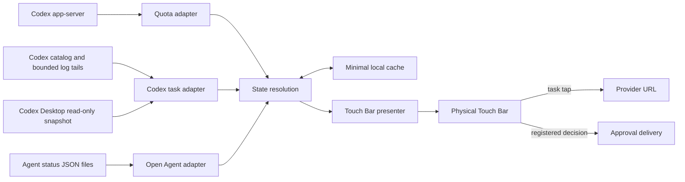

# Architecture

## Scope

RehireBar is a local macOS accessory application. It collects a bounded set of status facts, resolves them into provider-neutral task snapshots, and presents those snapshots through a system-modal Touch Bar. It does not host a network service or read conversation bodies.

The Swift package has two modules:

- `AgentStatusCore` owns Foundation-only public data contracts and reusable cache persistence.
- `ModelDisplayConfiguration` and `ModelDisplayFormatter` in that module define the versioned display policy independently of AppKit. The app loads its editable JSON mappings through `ModelDisplayConfigurationLoader`; the presenter contains no model-family table.
- `RehireBar` owns collection adapters, state resolution, lifecycle, explicit actions, AppKit, and the private Touch Bar compatibility layer.

Codex is the first built-in provider, not the application architecture. A custom provider enters through the same status contract and does not add provider-specific state names or layout rules to the presenter.

## Data flow



## Identity and truth

Every task is keyed by `(providerID, scopeID, taskID)`. Titles, project names, host labels, and timestamps are presentation metadata and never identity.

Unknown values stay absent. The application does not manufacture model names, token counts, context windows, remote labels, or task states. Active claims expire when their source stops publishing; stale work becomes `unknown`, and a host in connection recovery becomes `syncing`.

This rule is especially important for remote tasks: catalog activity can mean title changes, synchronization, or settings updates. It cannot establish that a turn is running.

## Main responsibilities

| Area | Representative types | Responsibility |
| --- | --- | --- |
| Public contract | `AgentStatusDocument`, `TaskIdentity`, `StatusCacheSnapshot` | Stable, Foundation-only external and cached models. |
| Composition | `RehireBarApplication` | Constructs concrete adapters and injects them into the coordinator. |
| Lifecycle | `AppCoordinator`, `SingleInstanceGuard`, `ApplicationMenuController` | Start once, refresh safely, respect manual collapse, and quit cleanly. |
| Codex adapter | `CodexSessionCatalogProvider`, `CodexDesktopThreadSnapshotCache`, `SessionLogUsageProvider` | Translate bounded Codex metadata into the common task model. |
| Open Agent adapter | `AgentStatusDirectoryProvider` | Load independent JSON providers and isolate malformed documents. |
| State resolution | `CurrentSessionProvider`, `LiveSessionStatusProvider`, `SessionMonitoringOrder` | Merge evidence with freshness and host-recovery precedence; order tasks independently of focus. |
| Diagnostics | `DoctorCommand`, `DoctorReport`, `CodexVersionProbe` | Read versions, source presence, and cache ages without starting the app lifecycle or asserting untested runtime behavior. |
| Presentation | `TouchBarPresenter`, `TouchBarGeometry`, `SystemModalRuntime` | Lay out available facts without provider knowledge. |
| Explicit actions | `WorkspaceTaskOpener`, `ConversationApprovalCoordinator` | Open only tapped task URLs and deliver only registered decisions. |

## Refresh model

Startup and live refresh are separate paths:

1. An eligible minimal cache can paint immediately.
2. The focused task resolves next.
3. Quota and the full task collection enrich independently.
4. File and focus events enter one coalescing refresh gate.
5. An adaptive timer provides a 2.5-second active, 5-second unresolved, and 12-second idle safety net.
6. Repeated failures back off while the last still-eligible facts remain visible.

Quota and task freshness are tracked independently. A quick task update must never make an old quota reading look current. Requests do not overlap; an event during a read becomes one follow-up refresh.

The Codex adapter reads up to 256 recent catalog rows and retains each task by its
complete identity. Project membership does not group cards, and the viewport does
not truncate the collection. Cached runtime evidence is applied to every collected
task. Each refresh schedules at most four runtime reads: up to three prioritize
active tasks and the unambiguous focused task, while the remaining capacity rotates
through other tasks. Least-recently-scheduled tasks go first within each group, so
tasks outside the first screen are still discovered. Existing IPC failure backoff
and evidence expiry apply independently to each identity.

File-event bursts may refresh cached facts immediately, but runtime read batches
are spaced at least 2.5 seconds apart. Each IPC read owns a temporary follower
connection and closes it after the snapshot; another task cannot evict that
connection during a read. Typed snapshots remain in the per-task cache. New token
progress renews evidence for an already-running local turn without resetting its
start time or reviving a completed/waiting turn.
Blocking status socket reads use a dedicated dispatch queue and two-second socket
timeouts, keeping unavailable tasks from occupying Swift's cooperative workers.

Focus is a metadata and polling hint, never a task-state observation or display
priority. The order is `RUN`, `WAIT`, `ERR`, `SYNC`, then idle/unknown. Within a state,
active projects precede inactive projects, then project activity and task activity
sort newest first. Complete identity only breaks ties. Projects are scoped by
provider, host, and stable project ID (Codex falls back to its full working path).
Project names never merge projects or tasks. The presenter follows this supplied order
and preserves the viewport when only Codex focus changes. Older focused rollout
data cannot overwrite newer context/model fields, revive expired running state, or
restore a compaction flag that the task's newer snapshot cleared.

`lastActivityAt` is independent of `observedAt`. Codex activity comes from catalog
`source_recency_at`, genuine rollout events, and known turn-start times. Metadata
updates, runtime reads, host reconnects, and focus observations do not advance it.
An Agent can publish `lastActivityAt` and `projectID` through the v1 contract;
missing activity stays absent and sorts after known activity within the same group.

Local release testing runs the ZIP's extracted bundle under `release/test/` through
`scripts/test-release.sh`. An explicit `--status-output` launch argument enables a
private diagnostic file mirroring the coordinator's ordered collection. The script
checks the executable path and producing PID, so an already-running installed copy
cannot be mistaken for the tested release. Normal launches create no diagnostic file.

## Privacy and action boundaries

- Reads are bounded and local. Agent JSON documents are limited to 1 MiB and opened relative to a pinned directory descriptor; symlinks and special files are rejected without waiting on a writer.
- Parsers discard unrelated lines and conversation content.
- Desktop task snapshots are read-only. Task mutation routes are not status probes.
- Task navigation runs only after a user taps a real card and delegates host resolution to the provider URL.
- Approval delivery is a separate explicit path and fails closed unless the exact task is confirmed.
- Ordinary refreshes never re-present a Touch Bar that the user manually collapsed.
- Successful empty task collections clear old cards; quota-only updates preserve them. Quota failures mark retained quota stale while keeping task cards visible. The health check expires retained active evidence even when task collectors fail.
- Raw logs, local databases, task screenshots, and development evidence do not belong in the public repository.

## Extension rule

Read [Agent status interface v1](integrations/AGENT-STATUS-INTERFACE.md) before adding a provider. A provider should publish facts in the shared contract. It must not teach the UI a new provider-specific meaning for colors, state names, navigation, or missing data.

Read [Model display interface v1](integrations/MODEL-DISPLAY-INTERFACE.md) to customize model labels. Exact provider aliases precede global aliases and configurable prefix/suffix rules. Raw source IDs and evidence remain intact. The 64 KiB local policy is reloaded on status updates and falls back to the bundled document when invalid; both it and Agent files use the same bounded, symlink-safe file reader.

## Validation boundary

Run after every change:

```bash
swift test
swift build -c release
bash scripts/build-app.sh
bash scripts/verify-app.sh
```

Automated tests cover contracts, parsing, identity, freshness, cache behavior, refresh coordination, fail-closed actions, and presentation view models. A supported physical Touch Bar is still required to validate actual width, animation, Control Strip interaction, collapse/restore, app switching, and sleep/wake behavior.
